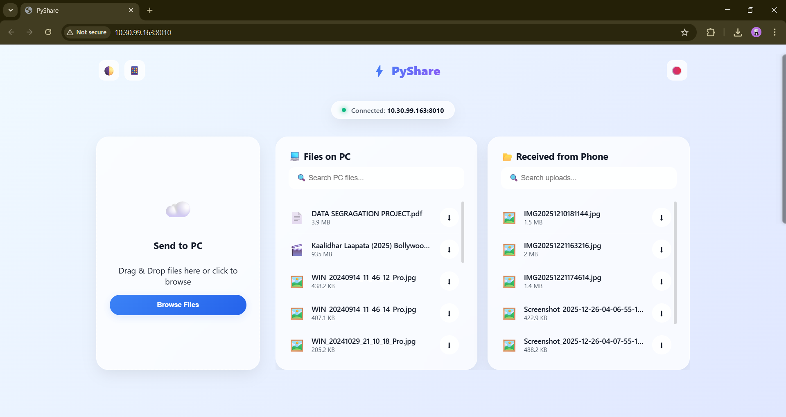

# PyShare 📲


**PyShare** is a lightweight, high-speed Python tool to share files between your PC and mobile devices over your local WiFi network. 

The latest version (**v2.0**) features a stunning **Glassmorphism UI**, real-time file searching, drag-and-drop uploads, and automatic Dark/Light mode switching.

## 🚀 Features

- **🎨 Modern Glassmorphism UI:** A beautiful interface with frosted glass effects, gradients, and smooth animations.
- **🌗 Dark & Light Themes:** Automatically detects your system preference, or toggle manually.
- **⚡ Single Page Application (SPA):** Instant interactions without page reloads.
- **📂 Smart File Management:** - **Dual Lists:** Clearly separates "Files on PC" from "Received from Phone".
  - **Real-Time Search:** Filter through hundreds of files instantly as you type.
- **☁️ Drag & Drop Uploads:** Simply drag files into the box to upload from phone or PC.
- **📊 Visual Progress Bar:** See upload percentages in real-time.
- **📱 Easy Connection:** Scan the generated QR code to connect instantly.
- **🔐 Offline Privacy:** Works entirely over LAN (Local Area Network) – no internet required.

## 📸 Screenshots

| **Desktop View** | **Mobile View** |
|:----------------:|:---------------:|
| <br><br> | <br><br><br> |
| *Clean 3-column dashboard* | *Responsive single-column layout* |


## 📂 Directory Structure

```text
PyShare/
├── main.py             # Main Server Script (Backend)
├── index.html          # Frontend Interface (HTML5)
├── styles.css          # Glassmorphism Styling (CSS3)
├── scripts.js          # App Logic (Search, Uploads, API)
├── requirements.txt    # Dependencies
├── qrcode.png          # (Generated automatically on startup)
└── SharedFiles/
    ├── From_Phone/     # 📥 Files uploaded by devices appear here
    └── From_PC/        # 📤 Put files here to share them

```

## 🛠️ Installation

1. **Install Python 3.x** if you haven't already.
2. Clone this repository or download the files.
3. Install the dependencies (mainly for QR code generation):

```bash
pip install -r requirements.txt

```

*(Note: If you don't have a `requirements.txt`, simply run: `pip install pyqrcode pypng`)*

## 🖥️ Usage

1. **Start PyShare:**
Open your terminal/command prompt in the `PyShare` folder and run:
```bash
python main.py

```


2. **Connect via Phone:**
* The terminal will display a URL (e.g., `http://192.168.1.10:8010`).
* A `qrcode.png` file is generated. **Scan it** with your phone to open the app.
* *Tip: You can also click the 📱 button in the web app to see the QR code.*


3. **Transfer Files:**
* **Phone → PC:** Drag and drop files into the **"Send to PC"** box. They will appear in `SharedFiles/From_Phone`.
* **PC → Phone:** Place files in `SharedFiles/From_PC`. They will appear in the "Files on PC" list instantly.


4. **Stop Server:**
* Click the **🛑 Disconnect Server** button on the web interface, or press `Ctrl+C` in the terminal.


## ⚠️ Important Notes

* **Same Network:** Your PC and Phone must be connected to the **same WiFi network**.
* **Firewall:** If you cannot connect, ensure your PC's firewall allows Python to accept incoming connections on port `8010`.

## 📜 License

This project is licensed under the MIT License - see the [LICENSE](LICENSE) file for details.
