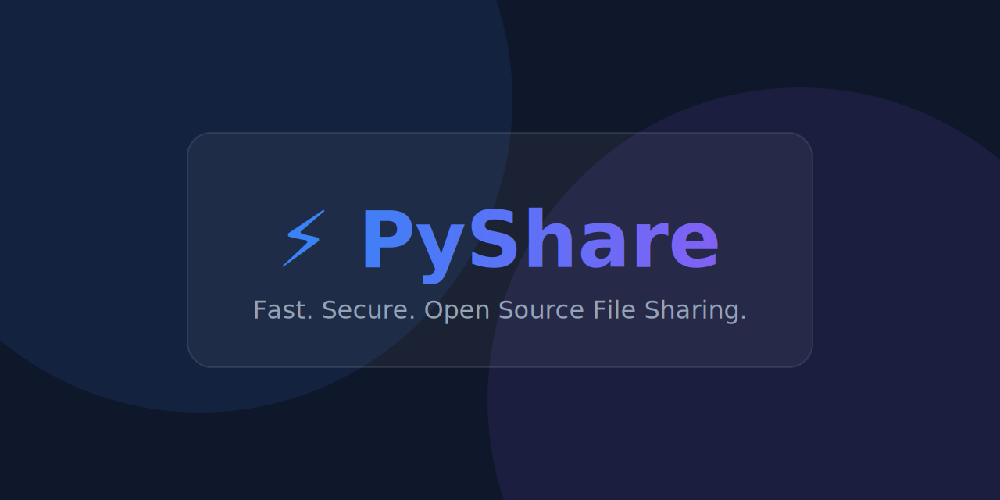
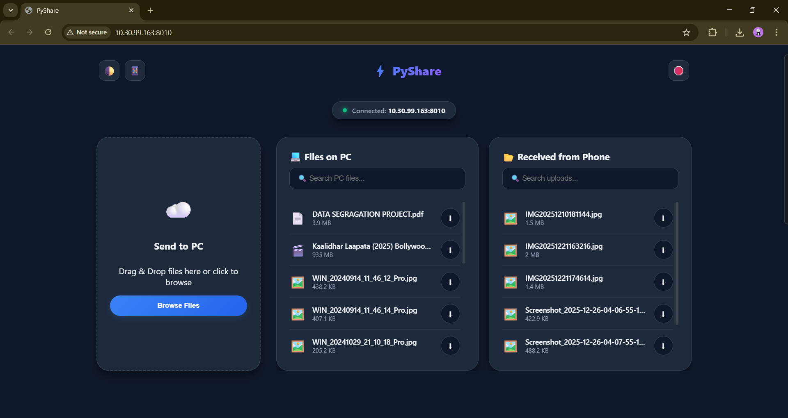
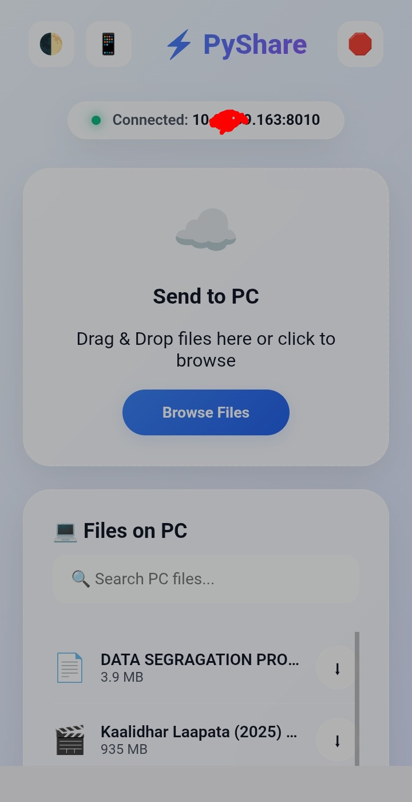
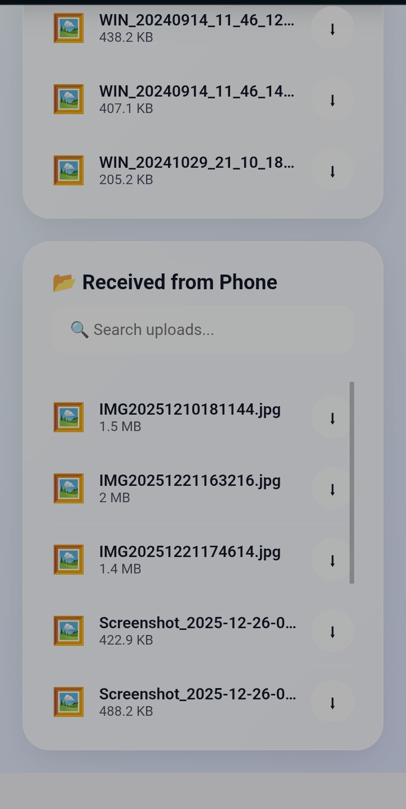
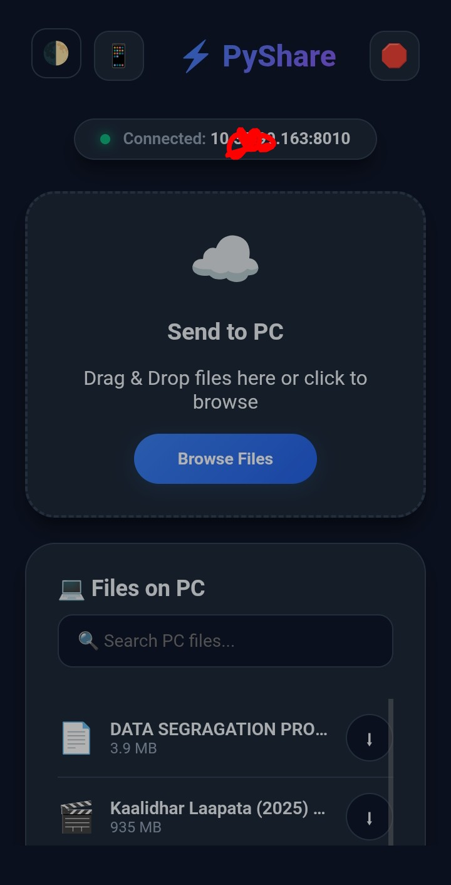
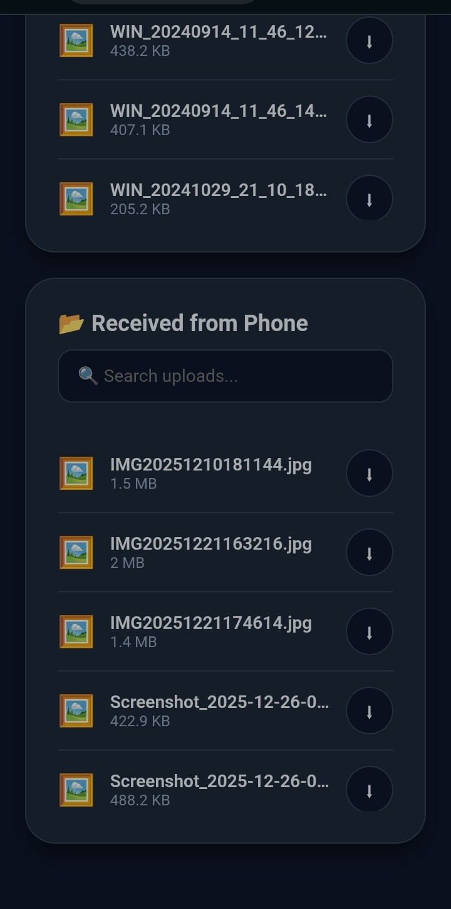

<div align="center">

  <h1>⚡ PyShare 📲</h1>

  

  <br><br>

  <strong>A lightweight, high-speed Python tool to share files between PC and Mobile over Wi-Fi.</strong>

  <p>
    <a href="#-download">Download</a> •
    <a href="#-features">Features</a> •
    <a href="#-usage">Usage</a> •
    <a href="#-installation-for-developers">Installation</a>
  </p>

</div>

<br>

**PyShare** is a modern, ultra-fast local file sharing tool. The latest version features a stunning **Glassmorphism UI**, real-time file searching, drag-and-drop uploads, and automatic Dark/Light mode switching.

## 📥 Download (Recommended)
**Windows Users:** For the best experience, download the standalone **PyShare.exe** from the [Latest Releases](https://github.com/pattanayakpratik/pyshare/releases) page. 
* **No Setup Required:** Run the app directly without installing Python.
* **Professional Branding:** Includes a custom application icon.
* **Self-Contained:** All assets (HTML/CSS/JS) are bundled inside the single executable.

---

## 🚀 Features

- **🎨 Modern Glassmorphism UI:** A beautiful interface with frosted glass effects and smooth animations.
- **📂 Desktop Integration:** Automatically creates a `PyShare_Files` folder on your **Desktop** and opens it for you.
- **🚀 Smart Launch:** Automatically opens your web browser to the correct URL when started.
- **🔌 Port Protection:** Automatically finds an open port (8010-8020) if the default is busy.
- **🌗 Dark & Light Themes:** Automatically detects system preference or toggle manually.
- **📂 Smart File Management:**
  - **Dual Lists:** Clearly separates "Files on PC" from "Received from Phone".
  - **Real-Time Search:** Filter through hundreds of files instantly as you type.
- **☁️ Drag & Drop Uploads:** Simply drag files into the box to upload from phone or PC.
- **📊 Visual Progress Bar:** See upload percentages in real-time.
- **📱 Easy Connection:** Scan the generated QR code to connect instantly.
- **🔐 Offline Privacy:** Works entirely over LAN (Local Area Network)—no internet required.

## 📸 Screenshots

### 🖥️ Desktop View


### 📱 Mobile View
   

## 🖥️ Usage

### 1. Start PyShare
* **App:** Double-click `PyShare.exe`.
* **Source:** Open your terminal in the `PyShare` folder and run `python main.py`.

### 2. Connect via Phone
* **QR Code:** The app displays a QR code automatically. Scan it with your phone to open the interface.
* **Manual URL:** You can also enter the URL shown in the terminal (e.g., `http://192.168.1.10:8010`) into your mobile browser.
* *Tip: You can also click the 📱 button in the web app to see the QR code.*

### 3. Transfer Files
* **To PC:** Drag and drop files into the **"Send to PC"** box on your phone. They will appear in `Desktop/PyShare_Files/From_Phone`.
* **To Phone:** Place files in `Desktop/PyShare_Files/From_PC`. They will appear in the **"Files on PC"** list on your phone instantly.

### 4. Stop Server
* **Web UI:** Click the **🛑 Disconnect Server** button on the web interface.
* **Terminal:** Press `Ctrl+C` in your terminal window.

## 🛠️ Installation (For Developers)

1. **Install Python 3.x** if you haven't already.
2. Clone this repository and navigate to the folder.
3. Install the dependencies:
```bash
pip install -r requirements.txt

```

*(Note: Requires `pyqrcode` and `pypng`.)*

## ⚠️ Important Notes

* **Same Network:** Your PC and Phone must be connected to the **same Wi-Fi network**.
* **Firewall:** If you cannot connect, ensure your PC's firewall allows Python/PyShare to accept incoming connections on port `8010`.

## 📜 License

This project is licensed under the MIT License - see the [LICENSE](LICENSE) file for details.

