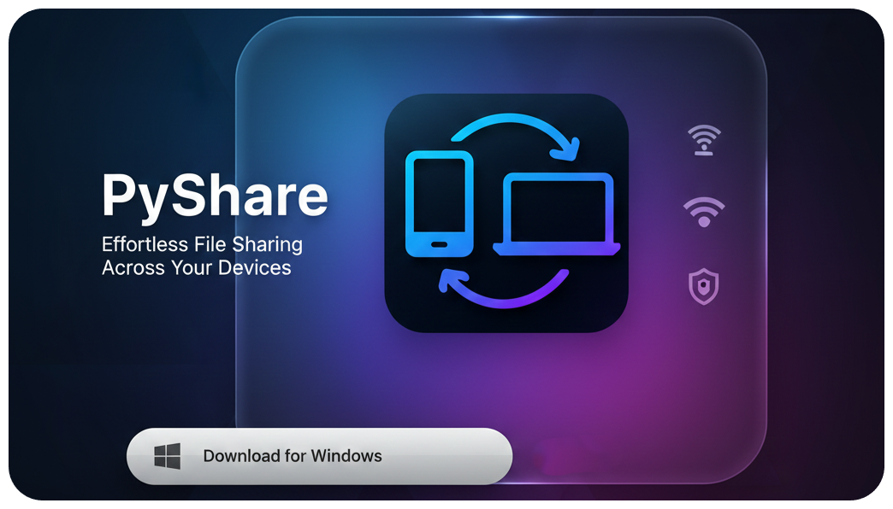
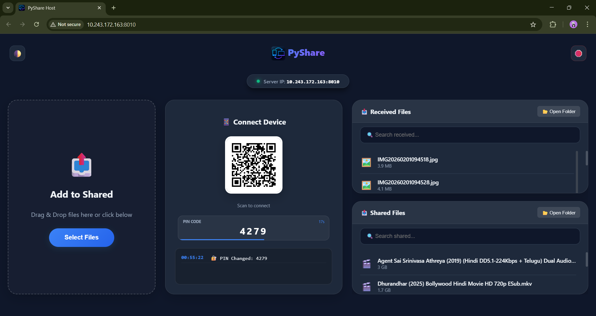
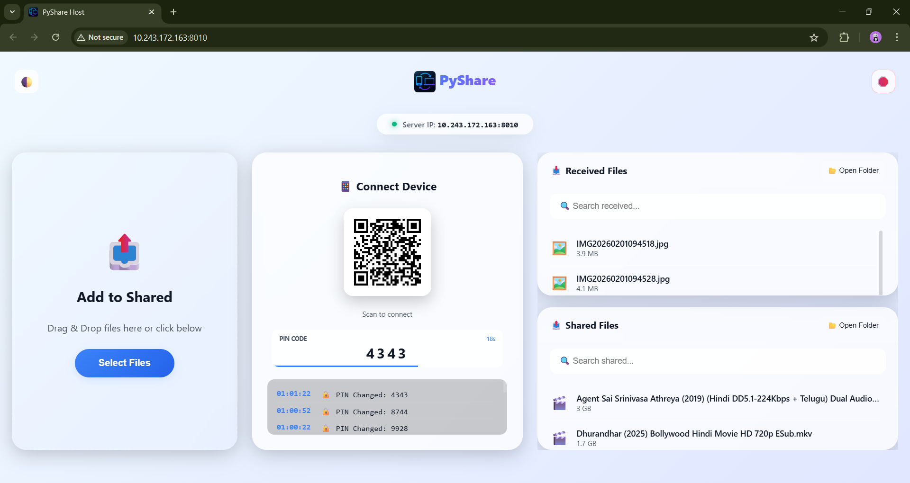
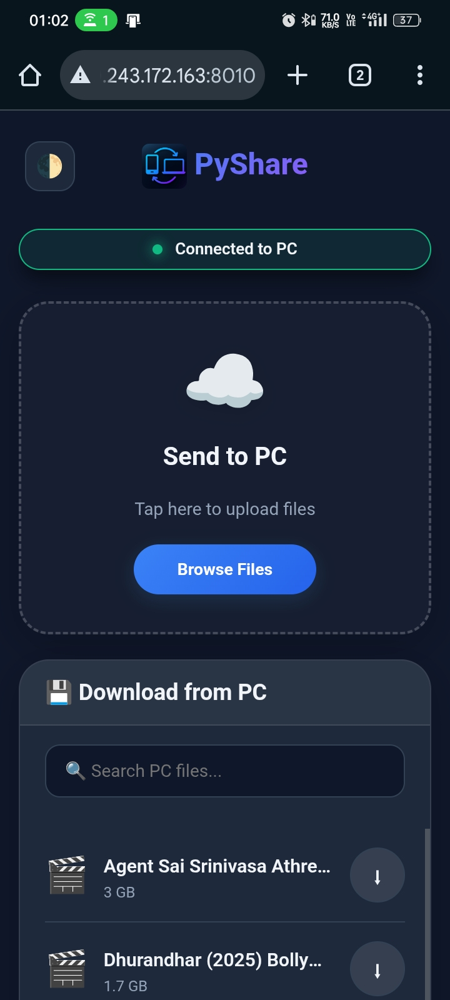
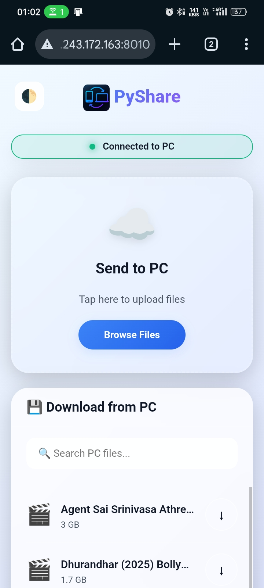
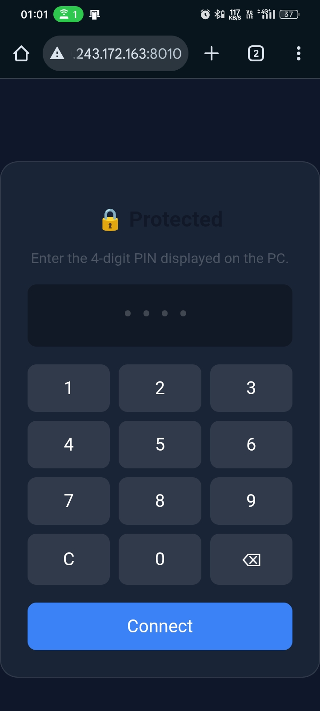
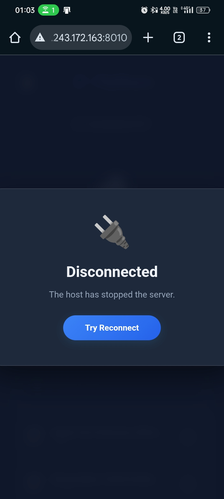

<div align="center">

  <h1 align="center">
  
  
  PyShare
</h1>
  <strong>A lightweight, high-speed Python tool to share files between PC and Mobile over Wi-Fi.</strong>

  <p>
    <a href="#-download-recommended">Download</a> •
    <a href="#-features">Features</a> •
    <a href="#%EF%B8%8F-usage">Usage</a> •
    <a href="#%EF%B8%8F-installation-for-developers">Installation</a>
  </p>

</div>

<br>

**PyShare** is a modern, ultra-fast local file sharing tool. The latest version features a stunning **Glassmorphism UI**, real-time file searching, drag-and-drop uploads, and automatic Dark/Light mode switching.


## 📥 Download (Recommended)

**Windows Users:** For the best experience, download the standalone **PyShare.exe** from the [Latest Releases](https://github.com/pattanayakpratik/pyshare/releases) page.

* **No Setup Required:** Run the app directly without installing Python.
* **Professional Branding:** Includes a custom application icon.
* **Self-Contained:** All assets (HTML/CSS/JS) and dependencies (pyqrcode, pypng) are bundled inside.

### 🚀 Standalone Executable

* **PyShare (Windows EXE)** 👉 **[Download PyShare.exe](https://github.com/pattanayakpratik/PyShare/releases/download/v3.0.1/PyShare.exe)**

### 📦 Compressed Archives (Recommended if EXE is blocked)

* **PyShare (Windows ZIP)** 👉 **[Download PyShare.zip](https://github.com/pattanayakpratik/PyShare/releases/download/v3.0.1/PyShare.zip)**
* **PyShare (Linux/macOS TAR)** 👉 **[Download PyShare.tar.gz](https://github.com/pattanayakpratik/PyShare/archive/refs/tags/v3.0.1.tar.gz)**

### 💻 Source Code (For Developers)

* **Source (ZIP)** 👉 **[v3.0.1.zip](https://github.com/pattanayakpratik/PyShare/archive/refs/tags/v3.0.1.zip)**
* **Source (TAR)** 👉 **[v3.0.1.tar.gz](https://github.com/pattanayakpratik/PyShare/archive/refs/tags/v3.0.1.tar.gz)**


*⚠️ **Note:** If Windows SmartScreen shows a warning, click **More info → Run anyway**. The app is entirely local and safe to use.*


## 🆕 What's New (v3.0.1)
- **🖥️ Separate Dashboards:** Dedicated interfaces for the Host (PC) and Client (Mobile) for a streamlined experience.
- **🔒 Secure PIN Authentication:** A rotating 4-digit PIN (changing every 30s) prevents unauthorized access.
- **⏱️ Live Timer:** Visual countdown timer for PIN rotation on the Host dashboard.
- **🔌 Disconnect Detection:** Clients are visually notified immediately if the server is stopped.
- **📂 Smart Organization:** Files are automatically sorted into `Received_Files` and `Shared_Files`.
- **🛡️ Security Fixes:** Implemented path traversal protection and session validation.

## 🚀 Features

- **🎨 Modern Glassmorphism UI:** A beautiful interface with frosted glass effects and smooth animations.
- **📂 Desktop Integration:** Automatically creates a `PyShare_Files` folder on your **Desktop** and opens it for you.
- **🚀 Smart Launch:** Automatically opens your web browser to the correct URL when started.
- **🔌 Port Protection:** Automatically finds an open port (8010-8020) if the default is busy.
- **🌗 Dark & Light Themes:** Automatically detects system preference or toggle manually.
- **📂 Smart File Management:**
  - **Dual Lists:** Clearly separates "Files on PC" from "Received from Phone".
  - **Real-Time Search:** Filter through hundreds of files instantly as you type.
- **☁️ Drag & Drop:**
  - **Host:** Drag files to "Add to Shared".
  - **Client:** Drag files to "Send to PC".
- **📊 Real-Time Updates:** Live progress bars for uploads and instant activity logs.
- **📊 Visual Progress Bar:** See upload percentages in real-time.
- **📱 Easy Connection:** Scan the generated QR code to connect instantly.
- **🔐 Offline Privacy:** Works entirely over LAN (Local Area Network)—no internet required.

## 📸 Screenshots

### 🖥️ Host View



### 📱 client View
   


## 🖥️ Usage

### 1. Start PyShare
* **App:** Double-click `PyShare.exe`.
* **Source:** Open your terminal in the `PyShare` folder and run `python main.py`.

### 2. Connect via Phone
1.  **Scan QR Code:** Scan the QR code displayed on the Host Dashboard.
2.  **Enter PIN:** Look at the **Connection PIN** on your PC (it changes every 30s). Enter this PIN on your phone to log in.

### 3. Transfer Files
* **Phone → PC:** Tap "Browse Files" or drag files to send them to the PC. They appear in `Desktop/PyShare_Files/Received_Files`.
* **PC → Phone:** Drag files into the "Add to Shared" box on the PC. They appear in the "Download" list on your phone.

### 4. Stop Server
* **Web UI:** Click the **🛑 Disconnect Server** button. Clients will see a "Disconnected" message.
* **Terminal:** Press `Ctrl+C` in your terminal window.

## 🛠️ Installation (For Developers)

1. **Install Python 3.x** if you haven't already.
2. Clone this repository and navigate to the folder.
3. Install the dependencies:
```bash
pip install -r requirements.txt

```

*(Note: Requires `pyqrcode` and `pypng`.)*

## ⚠️ Important Notes

* **Same Network:** Your PC and Phone must be connected to the **same Wi-Fi network**.
* **Firewall:** If you cannot connect, ensure your PC's firewall allows Python/PyShare to accept incoming connections on port `8010`.

## 📜 License

This project is licensed under the MIT License - see the [LICENSE](LICENSE) file for details.

